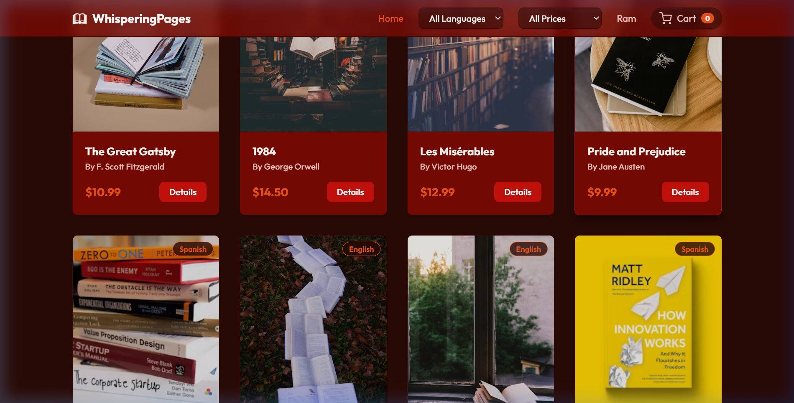
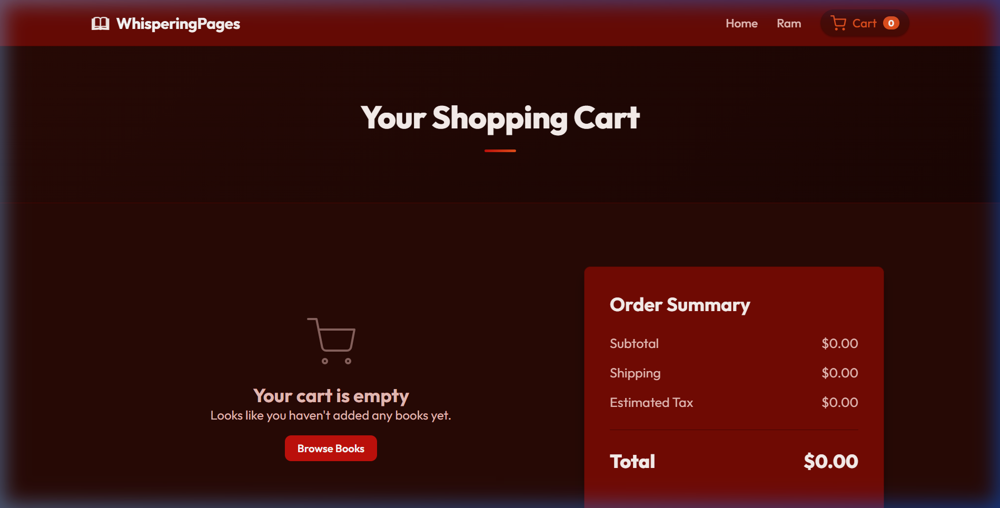
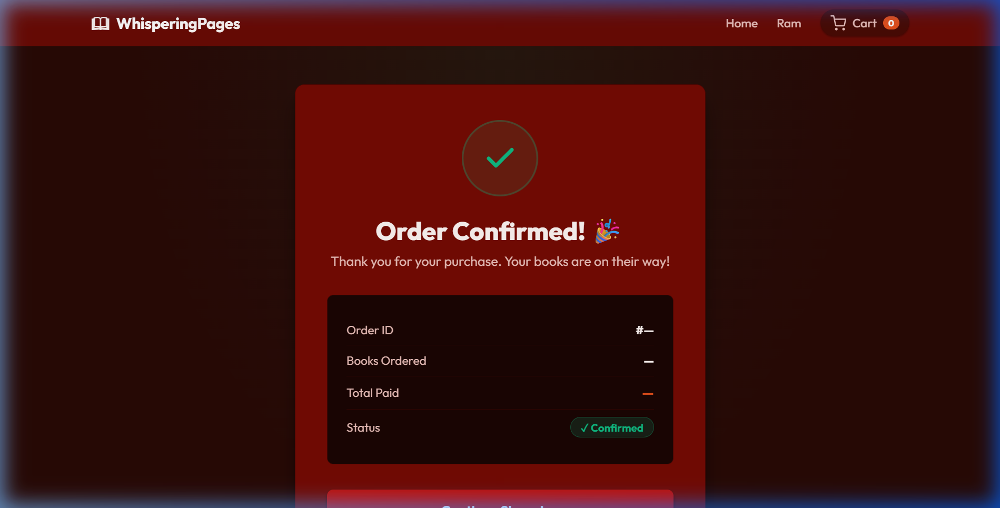

# 📚 Online Bookstore

A full-stack **Online Bookstore** web application built with **Spring Boot**, **Spring Web MVC**, **MySQL**, and a modern **HTML/CSS/JavaScript** frontend. Users can browse books, filter by language or price, view book details, write reviews, manage a shopping cart, and place orders.

---

## 🖥️ Live Screenshots

### 🏠 Home Page — Browse Books


### 🔑 Login / Register Page


### 📖 Book Detail Page


### 🛒 Cart Page


### ✅ Checkout Page


---

## 🚀 Features

| Feature | Description |
|---|---|
| 📦 Browse Books | View all books in a responsive card grid |
| 🔍 Search & Filter | Search by title/author; filter by language and max price |
| 📖 Book Details | Dedicated book detail page with full description |
| ⭐ Reviews | Add and view user reviews with star ratings |
| 🛒 Shopping Cart | Add/remove books; cart persists in MySQL |
| 💳 Checkout | Place orders with order summary stored in the database |
| 👤 Authentication | Register and login with session stored in localStorage |
| 📱 Responsive UI | Fully responsive layout for desktop, tablet, and mobile |

---

## 🏗️ Tech Stack

| Layer | Technology |
|---|---|
| **Backend** | Java 17, Spring Boot 3.2.4, Spring Web MVC |
| **Data Access** | Spring JDBC (`JdbcTemplate`) |
| **Database** | MySQL 8.x |
| **Frontend** | HTML5, CSS3, Vanilla JavaScript (ES6+) |
| **Build Tool** | Apache Maven (Maven Wrapper included) |
| **Server** | Embedded Apache Tomcat (port `8081`) |

---

## 📁 Project Structure

```
OnlineBookStore/
├── src/
│   └── main/
│       ├── java/com/glowlogics/bookstore/
│       │   ├── BookstoreApplication.java       # Spring Boot entry point
│       │   ├── controller/
│       │   │   ├── AuthController.java         # POST /api/auth/register & /login
│       │   │   ├── BookController.java         # GET /api/books, /api/books/{id}
│       │   │   ├── CartController.java         # GET/POST/DELETE /api/cart, POST /api/checkout
│       │   │   └── ReviewController.java       # GET/POST /api/books/{id}/reviews
│       │   └── model/
│       │       └── Book.java                   # Book POJO
│       └── resources/
│           ├── application.properties          # MySQL & server configuration
│           ├── schema.sql                      # Database DDL (tables)
│           ├── data.sql                        # Seed data (10 sample books)
│           └── static/                         # Frontend (served by Spring Boot)
│               ├── index.html                  # Home / Browse Books
│               ├── book.html                   # Book Detail
│               ├── login.html                  # Login / Register
│               ├── cart.html                   # Shopping Cart
│               ├── checkout.html               # Order Checkout
│               ├── css/
│               │   └── style.css               # Global stylesheet
│               └── js/
│                   └── app.js                  # All frontend JavaScript logic
├── screenshots/                                # Page screenshots (used in README)
├── pom.xml                                     # Maven dependencies
├── mvnw / mvnw.cmd                             # Maven wrapper scripts
└── README.md
```

---

## 🗄️ Database Schema

The application uses a MySQL database named **`storeonlinebook`** with the following tables:

```
books        — Book catalog (id, title, author, language, description, price, image_url)
users        — Registered users (id, name, email, password, created_at)
cart         — Shopping cart items (id, book_id, user_id)
orders       — Placed orders (id, user_name, user_email, total_amount, order_date, status)
order_items  — Individual items within an order
reviews      — Book reviews with star ratings (1–5)
```

---

## ⚙️ Prerequisites

Make sure the following are installed before running the project:

| Requirement | Version |
|---|---|
| Java JDK | 17 or higher |
| MySQL Server | 8.x |
| Maven | Included via `mvnw` wrapper (no install needed) |

---

## 🛠️ Steps to Run the Project

### Step 1 — Clone the Repository

```bash
git clone https://github.com/your-username/OnlineBookStore.git
cd OnlineBookStore
```

---

### Step 2 — Set Up the MySQL Database

Open **MySQL Workbench** or your **MySQL CLI** and run the following:

```sql
-- 1. Create the database
CREATE DATABASE IF NOT EXISTS storeonlinebook;
USE storeonlinebook;
```

Then execute the schema and seed files provided in `src/main/resources/`:

```sql
-- 2. Run schema.sql to create all tables
SOURCE src/main/resources/schema.sql;

-- 3. Run data.sql to insert sample books
SOURCE src/main/resources/data.sql;
```

> **Tip:** You can also open these `.sql` files directly in MySQL Workbench and click **Execute (⚡)**.

---

### Step 3 — Configure Database Credentials

Open `src/main/resources/application.properties` and update the MySQL password to match your local MySQL installation:

```properties
spring.datasource.url=jdbc:mysql://localhost:3306/storeonlinebook?useSSL=false&serverTimezone=UTC&allowPublicKeyRetrieval=true
spring.datasource.username=root
spring.datasource.password=YOUR_MYSQL_PASSWORD   # ← Change this
spring.datasource.driver-class-name=com.mysql.cj.jdbc.Driver
server.port=8081
spring.sql.init.mode=never
```

---

### Step 4 — Build & Run the Application

Use the **Maven Wrapper** included in the project (no Maven installation required):

**Windows (PowerShell or CMD):**
```powershell
.\mvnw.cmd spring-boot:run
```

**Linux / macOS:**
```bash
./mvnw spring-boot:run
```

You should see output ending with:
```
Tomcat started on port 8081 (http) with context path ''
Started BookstoreApplication in X.XXX seconds
```

---

### Step 5 — Open in Browser

Navigate to:

```
http://localhost:8081
```

| Page | URL |
|---|---|
| 🏠 Home (Browse Books) | http://localhost:8081/index.html |
| 🔑 Login / Register | http://localhost:8081/login.html |
| 📖 Book Detail | http://localhost:8081/book.html?id=1 |
| 🛒 Shopping Cart | http://localhost:8081/cart.html |
| ✅ Checkout | http://localhost:8081/checkout.html |

---

## 🔌 REST API Endpoints

### 📚 Books

| Method | Endpoint | Description |
|---|---|---|
| `GET` | `/api/books` | Get all books (supports `?search=`, `?language=`, `?maxPrice=`) |
| `GET` | `/api/books/{id}` | Get a single book by ID |
| `GET` | `/api/books/languages` | Get language counts for filter sidebar |

### 🛒 Cart & Orders

| Method | Endpoint | Description |
|---|---|---|
| `GET` | `/api/cart` | Get all items in the cart |
| `POST` | `/api/cart` | Add a book to the cart (`{ bookId: Long }`) |
| `DELETE` | `/api/cart/{id}` | Remove a cart item by cart entry ID |
| `POST` | `/api/checkout` | Place an order and clear the cart |

### 👤 Authentication

| Method | Endpoint | Description |
|---|---|---|
| `POST` | `/api/auth/register` | Register a new user |
| `POST` | `/api/auth/login` | Login with email and password |

### ⭐ Reviews

| Method | Endpoint | Description |
|---|---|---|
| `GET` | `/api/books/{id}/reviews` | Get all reviews for a book |
| `POST` | `/api/books/{id}/reviews` | Submit a review for a book |

---

## 🌐 Pages Overview

| Page | File | Description |
|---|---|---|
| **Home** | `index.html` | Displays all books in a card grid with search, language filter, and price filter |
| **Book Detail** | `book.html` | Shows full book info, reviews, and "Add to Cart" button |
| **Login / Register** | `login.html` | Toggle between login and registration forms |
| **Cart** | `cart.html` | Lists cart items with remove option and total price |
| **Checkout** | `checkout.html` | Confirms the order and places it via the API |

---

## 📦 Key Dependencies (`pom.xml`)

```xml
<dependencies>
    <!-- Spring MVC + Embedded Tomcat -->
    <dependency>
        <groupId>org.springframework.boot</groupId>
        <artifactId>spring-boot-starter-web</artifactId>
    </dependency>

    <!-- Spring JDBC (JdbcTemplate) -->
    <dependency>
        <groupId>org.springframework.boot</groupId>
        <artifactId>spring-boot-starter-jdbc</artifactId>
    </dependency>

    <!-- MySQL JDBC Driver -->
    <dependency>
        <groupId>com.mysql</groupId>
        <artifactId>mysql-connector-j</artifactId>
        <scope>runtime</scope>
    </dependency>
</dependencies>
```

---

## 🐛 Troubleshooting

| Problem | Solution |
|---|---|
| `Access denied for user 'root'@'localhost'` | Update the password in `application.properties` |
| `Unknown database 'storeonlinebook'` | Run `CREATE DATABASE storeonlinebook;` in MySQL first |
| Port 8081 already in use | Change `server.port` in `application.properties` or kill the process using the port |
| Books not showing on Home page | Ensure `data.sql` was executed and MySQL is running |
| Cart not persisting | Check the `cart` table exists and `schema.sql` was run |

---

# Author

## Kartik Nayak

Information Science Engineering Student  
Java Full Stack Developer  
Passionate about building responsive and scalable web applications.

---

## 📄 License

This project is for educational purposes. All rights reserved © 2026 Kartik Nayak.
